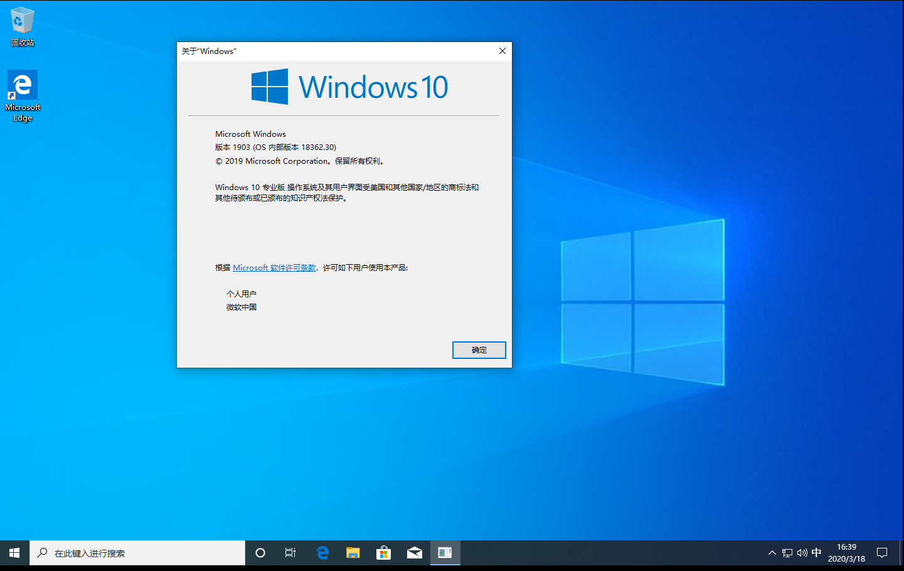

# SMBGhost_Crash_Poc

CVE-2020-0796 蓝屏的代码。twitter上发现的。本地虚拟机，Windows10专业版1903测试成功.



使用方法：

安装impacket库
```
git clone https://github.com/SecureAuthCorp/impacket.git
cd impacket
python setup.py install
```

直接使用pip安装的不行，所以需要clone然后安装，在MAC系统下需要sudo权限。

安装成功后，下载该代码。执行如下命令：

python gistfile1.py 目标IP

运行后效果：


代码原始地址：[https://gist.github.com/asolino/45095268f0893bcf08bca3ae68a755b2](https://gist.github.com/asolino/45095268f0893bcf08bca3ae68a755b2)

作者twitter :[https://twitter.com/agsolino](https://twitter.com/agsolino)
